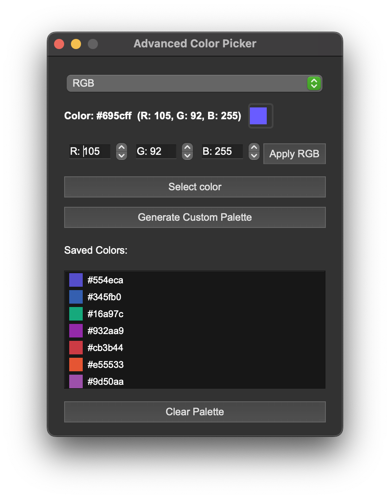

# Color Picker — приложение для выбора и сохранения цветов

Простой и удобный графический инструмент на PyQt6 для выбора цветов, отображения их значений в HEX и RGB, а также сохранения и управления палитрой.

---

## Возможности

- Выбор цвета через стандартный диалог выбора цвета.
- Ввод цвета вручную с помощью RGB-спиннеров.
- Автоматическая генерация палитры из 6 уникальных случайных цветов.
- Отображение выбранного цвета с HEX и RGB значениями.
- Сохранение выбранных цветов в палитру с возможностью выбора и удаления.
- Автоматическое копирование HEX-кода в буфер обмена при выборе цвета.
- Фиксированный размер окна (400x400), удобный и компактный интерфейс.

---

## Установка и запуск

1. Убедитесь, что у вас установлен Python 3.7+ и PyQt6:
```
pip install PyQt6
```

2. Скачайте или скопируйте файл `colorp.py`.

3. Запустите приложение командой:
```
python colorp.py
```

---

## Использование

- Нажмите кнопку **"Select color"** для выбора цвета через диалог.
- Введите значения RGB вручную и нажмите **"Apply RGB"** для применения.
- Нажмите **"Generate Custom Palette"** для создания случайной палитры из 6 цветов.
- Выберите цвет из палитры для его отображения и копирования HEX-кода.
- Нажмите **"Clear Palette"** для очистки сохранённых цветов.

---

## Скриншот

  
*Пример интерфейса приложения*

---

## Лицензия

MIT License © 2025

---

## Контакты

Если у вас есть вопросы или предложения, создайте issue или свяжитесь со мной через GitHub.

---

Спасибо за использование!
